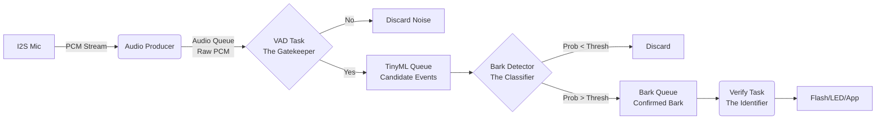

# 🐕 DogStopper
> **基于 ESP32 的超低功耗、分级式 AI 狗叫检测与声纹身份验证系统**

  

## 📖 项目简介 (Overview)

**DogStopper** 是一个完全运行在端侧（On-Device）的智能音频分析解决方案，它不依赖云端，完全在本地完成从音频采集、噪音过滤、狗叫检测到具体“狗份”身份验证的全过程。。它利用 ESP32-S3 的异构内存架构和 FreeRTOS 多任务机制，实现了一条从**音频采集**到**行为检测**再到**身份识别**的高效流水线。

本项目的核心目标是在保证极低误触发率（False Positive）的前提下，精准捕获狗叫事件，并通过声纹（Embedding）技术识别具体的“狗份”（例如：是自家的狗还是陌生狗）。

## ✨ 核心功能与亮点

* **分级流水线架构**：采用 Producer-Consumer 模型，通过 FreeRTOS 队列解耦 I2S 采集、VAD 过滤、AI 推理和业务验证。
    * **L1 采集层**：I2S 高速采集 + 硬件级 DC 偏置滤波。
    * **L2 门控层 (VAD)**：基于能量、高频占比、过零率 (ZCR) 的四级否决机制，极低功耗过滤环境音。
    * **L3 检测层 (Detection)**：TinyML 模型识别狗叫，配合 **Top-K 滑窗策略**，从长音频中精准捕捉最佳识别帧。
    * **L4 验证层 (Verification)**：基于 Log-Mel Embedding 的声纹比对，识别是“自家狗”还是“陌生狗”，支持模版自学习与 Flash 持久化。
* **鲁棒的 VAD (语音活动检测)**：四级否决机制（能量/高频占比/过零率/峰值），有效过滤风噪、音乐和环境中的人声，只放行疑似狗吠的事件。
* **智能事件拼接**：支持 Pre-pad（前向填充）和迟滞处理，确保不会因为 VAD 启动延迟而丢失狗叫的起始音节。
* **TinyML 模型推理**：
    * **Stage 1 (检测)**：基于 MFCC 的分类模型，支持 Top-K 筛选策略，从长音频中提取概率最高的片段。
    * **Stage 2 (验证)**：基于 Log-Mel 的声纹 Embedding 模型。
* **混合内存管理 (SRAM + PSRAM)**：
    * 实时音频流处理使用内部高速 SRAM。
    * 大容量队列和长音频片段缓冲使用外部 PSRAM，防止内存溢出。
* **自适应丢帧策略**：实现了类似 Ring Buffer 的队列机制，当系统过载时优先保留**最新**的音频数据。

* **低功耗设计**：目前只支持 CPU 锁频 (Lock Frequency) 策略，后续需要设计为动态调节频率，以平衡性能与功耗。

---

## 🏗️ 系统架构 (System Architecture)

系统被设计为一条单向流动的数据流水线，数据流向严格遵循单向漏斗模型，层层递进，数据量逐级递减，信息密度逐级递增。



## 📂 文件结构与导读 (File Structure)

本项目基于 **PlatformIO** 开发，主要目录结构如下：

```text
DogStopper/
├── src/                    # 核心源代码
│   ├── main.cpp            # [入口] 系统初始化，创建队列，启动4大核心任务
│   ├── audio_input.cpp     # [生产者] I2S 驱动配置，DC滤波，Push audio_queue
│   ├── audio_consumer.cpp  # [消费者1] VAD 逻辑，状态机切片，组装事件 Push tinyml_queue
│   ├── bark_detector.cpp   # [消费者2] 狗叫分类模型，Top-K 筛选 Push bark_queue
│   ├── verify_embedding.cpp # [消费者3] 声纹特征提取，Embedding 推理与验证
│   └── led_control.cpp     # LED 状态反馈
│   ├── .....               # 其他实现文件  
├── include/                # 公共头文件
├── components/             # 组件库
│   ├── arduino/            # arduino库
├── lib/                    # 外部依赖库
│   ├── TensorFlowLite_ESP32/ # TFLM库
├── python/                 # 音频特征提取和模型设计与训练开发验证
├── test/                   # 功能测试代码
├── platformio.ini          # PlatformIO 配置文件
└── partitions_singleapp_large.csv  # 大容量分区表配置
```


## 🛠️ 关键技术细节

### 1. 语音活动检测 (VAD) 策略
位于 `audio_consumer.cpp`，旨在“宁可错杀，不可放过连续噪音”，通过四级门控降低 AI 唤醒功耗：
* **能量门限**：初步过滤环境底噪。
* **高频占比 (HF Ratio)**：关键逻辑。通过计算高频能量与总能量的比值，有效剔除风噪、机械音和连续音乐。
* **过零率 (ZCR)**：辅助剔除高频纯音或震荡信号。

### 2. Top-K 推理机制
位于 `bark_detector.cpp`：
* 当检测到长音频（>200ms）时，系统不会对每一帧都触发推理。
* 使用**滑窗扫描**整段音频并计算每一窗的概率。
* 最终仅输出概率最高的 **K 个切片**进入下一级声纹验证，极大降低了误触发率和算力浪费。

### 3. 内存与队列设计
* **audio_queue**：深度较小，驻留 **SRAM**，保证 I2S 实时性。
* **tinyml_queue**：存储完整的 `TinyMLEvent` (含 PCM 数据)，驻留 **PSRAM**。
* **bark_queue**：存储确认为狗叫的片段，驻留 **PSRAM**。
* **防堵塞逻辑**：所有队列写入均实现了“覆盖旧数据”机制，确保系统始终处理最新的音频事件。


## 🚀 快速开始 (Quick Start)

### 硬件要求
* **主控**：ESP32-S3 (推荐，含 AI 指令集加速，必须配备 PSRAM)。
* **麦克风**：MSM261 (I2S 接口)。

### 编译环境 (PlatformIO)
本项目不使用 ESP-IDF 命令行，请确保已安装 PlatformIO 环境：
1.  使用 VS Code 打开项目文件夹 `DogStopper`。
2.  **开启 PSRAM 支持**：在 `platformio.ini` 中确认已添加以下标志：
    ```ini
    board_build.flash_mode  = qio
    board_build.arduino.memory_type = qio_opi
    board_build.psram_type  = opi
    ```
3.  点击 PlatformIO 面板的 **Build** 进行编译。
4.  连接设备后点击 **Upload** 烧录，并打开 **Serial Monitor** 查看检测日志。


## 📚 引用与参考 (Citations)
1. [Esptool Documentation](https://docs.espressif.com/projects/esptool/en/latest/esp32s3/index.html)
2. [TinyML-TFLM](https://github.com/tensorflow/tflite-micro)
3. [esp-tflite-micro](https://github.com/espressif/esp-tflite-micro)
4. [esp-dsp](https://github.com/espressif/esp-dsp)
5. [esp-nn](https://github.com/espressif/esp-nn)
6. [使用 Arduino 开发 ESP32 简介](https://docs.geeksman.com/esp32/Arduino/01.esp32-arduino-intro.html)


### 📚 核心文档导读

为了更深入地理解本项目的设计思路、架构实现以及在开发过程中遇到的坑，建议按照以下顺序阅读相关文档。这些文档详细记录了从零到一构建系统时的关键决策与调试复盘：

* **[ESP32-S3端侧TinyML音频系统工程复盘.md](./ESP32-S3端侧TinyML音频系统工程复盘.md)**
    > **看点**：记录了开发中遇到的核心问题（如串口报错、滑窗设计，模块间的解耦等）及其解决方案，是针对 `DogStopper` 项目最真实的“排雷指南”。

* **[MCU实时音频处理架构设计文档.md](./MCU实时音频处理架构设计文档.md)**
    > **看点**：深入解析了系统四级流水线（采集、VAD、检测、验证）的设计逻辑，探讨了如何通过 FreeRTOS 队列实现高效的任务解耦与 PSRAM 内存管理。

* **[Mcu端狗吠声纹自学习系统设计说明.MD](./Mcu端狗吠声纹自学习系统设计说明.MD)**
    > **看点**：详细说明了声纹 Embedding 特征提取的实现细节，以及如何让系统在端侧实现“自学习”功能，动态更新和持久化存储已知狗叫的特征模板。


## 📝 联系与归属 (Contact & Ownership)
* **作者**：kend
* **邮箱**：<kend@carecoretech.com>
* **esp官方**：[Espressif](https://www.espressif.com/en/support/documents/technical-documents)
* **项目仓库**：[Gitee-dogstopper](https://gitee.com/szgxzl/dogstopper)
* **版权声明**：本仓库代码及相关作品归属权属于 **深圳市关芯智联科技有限公司** 所有。


## ⚠️ 注意事项 (Notes)
* **演示阶段**：本项目目前为功能演示（Demo），主要用于算法和架构的可行性验证。
* **优化计划**：后续将对 Demo 进行功耗管理和产品级的稳定性优化。本仓库将不再进行更新与提交。
* **平台迁移**：为了极致的性能压榨，后续将向 **ESP-IDF** 原生平台进行迁移重构。
* **持续关注**：最新的 IDF 版本开发进度与说明请关注 Gitee 仓库：
    👉 [https://e.gitee.com/szgxzl/repos/szgxzl/idfdog](https://e.gitee.com/szgxzl/repos/szgxzl/idfdog)